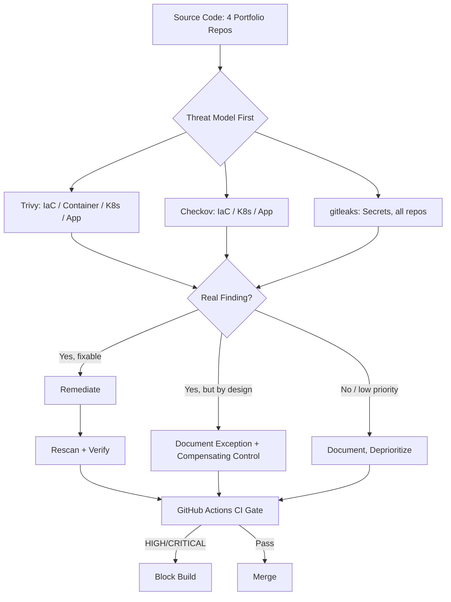

# DevSecOps Security

A security retrofit across four previous portfolio projects — Terraform/IaC, containers, Kubernetes, and a serverless API — demonstrating a full security lifecycle: threat modeling, detection, triage, remediation, verification, and CI/CD enforcement, with evidence for every claim.

**10 documented findings** across 5 security domains. **5 remediated and verified** (including one caught live by an automated CI gate and fixed the same day). **2 formally documented accepted-risk exceptions**, not silently ignored. **1 working GitHub Actions pipeline**, validated on real infrastructure, that failed once on a real gap — then passed after a real fix.

---

## Problem Statement

`three-tier-webapp`, `microservices-orders-users`, `eks-kubernetes-microservices`, and `serverless-orders` — four other repositories in this portfolio — were built to demonstrate infrastructure, containerization, Kubernetes, and serverless architecture

Where a real risk existed and could be fixed without contradicting the original design, it was fixed and verified — in one case down to a live Kubernetes pod's effective user ID, in another down to a passing GitHub Actions run. Where a "finding" turned out to be intentional design (a public, unauthenticated API) or an unpatched upstream dependency, it was documented as an accepted exception with a compensating control — not silently suppressed to make a scanner green.

## Architecture

This repository does not deploy new infrastructure. It retrofits security analysis onto existing infrastructure definitions from four other repositories in this portfolio:

| Source Project | Domain | What's Scanned Here |
|---|---|---|nano README.md
| `three-tier-webapp` | IaC Security | Terraform security groups, IAM |
| `microservices-orders-users` | Container Security | Dockerfile, built container image |
| `eks-kubernetes-microservices` | Kubernetes Security | Rendered Helm chart manifests |
| `serverless-orders` | Application Security | API Gateway Terraform module |
| *(this repo)* | Secrets Security | Full git history, all 5 repos |

Each domain follows the same lifecycle:

## Architecture Diagram



## Security Tools

| Tool | Used For | Domains |
|---|---|---|
| Trivy | Misconfiguration + vulnerability scanning | IaC, Container, Kubernetes, Application |
| Checkov | IaC/compliance security analysis | IaC, Kubernetes, Application |
| gitleaks | Secret detection (git history) | Secrets |
| Helm | Chart rendering (required before scanning templated K8s manifests) | Kubernetes |
| kind | Local Kubernetes cluster for live runtime verification (free, no AWS cost) | Kubernetes |
| GitHub Actions | CI/CD enforcement of the above | All domains |

## Repository Structure

```text
devsecops-security/
├── iac-security/{vulnerable,remediated}/ # Terraform, RDS security group
├── container-security/{vulnerable,remediated}/ # Dockerfile + built image
├── kubernetes-security/{vulnerable,remediated}/ # Helm chart
├── application-security/{vulnerable,remediated}/ # API Gateway Terraform module
├── secrets-security/ # gitleaks demo artifacts
├── .github/workflows/security.yml # CI/CD security pipeline
├── docs/
│   ├── findings.md # All 10 findings, full detail
│   ├── remediation.md # All 5 remediations, full detail
│   └── ci-cd-pipeline.md # Pipeline design + live validation results
└── evidence/{before,after}/ # Real scanner output, every finding
```

## How to Explore This Repository

This repo is not deployed — it's a static security analysis of infrastructure defined elsewhere. To reproduce any scan locally:

```bash
# IaC
trivy config iac-security/remediated/
checkov -d iac-security/remediated/

# Container (requires Docker)
docker build -t orders-service:remediated container-security/remediated/
trivy image orders-service:remediated

# Kubernetes (requires Helm)
helm template kubernetes-security/remediated/orders-chart/ > /tmp/rendered.yaml
trivy config /tmp/rendered.yaml

# Application
trivy config application-security/remediated/api-gateway/
checkov -d application-security/remediated/api-gateway/

# Secrets (entire repo history)
gitleaks detect --source . -v
```

The GitHub Actions pipeline (`.github/workflows/security.yml`) runs all of the above automatically on every push/PR to `main` — see [Actions](../../actions) for live run history.

## Security Pipeline / CI/CD

Full design, gating policy, and a real example of the pipeline catching (and then verifying the fix for) a live finding: **[docs/ci-cd-pipeline.md](docs/ci-cd-pipeline.md)**

Summary of the gating policy:

| Layer | Blocking? |
|---|---|
| Trivy, any domain, HIGH/CRITICAL | ✅ Yes |
| Checkov, documented exception (e.g. `CKV_AWS_309`) | ❌ No — inline-suppressed with justification |
| Checkov, other findings | ❌ No — reported, not yet severity-gated (documented limitation) |
| gitleaks, any detected secret | ✅ Yes |

**Real result:** On this pipeline's first live run, the Kubernetes Security job failed — Trivy caught 3 HIGH findings on a Helm test pod that had been manually deprioritized on Day 4 of this project. Rather than suppress the finding, it was fixed. The next push passed all 5 jobs. Full run history: [Actions tab](../../actions).

## Security Findings

Full detail for all 10 findings, including rule IDs, risk reasoning, and evidence file paths: **[docs/findings.md](docs/findings.md)**

| #  | Domain      | Finding                                                      | Status                                    |
| -- | ----------- | ------------------------------------------------------------- | ------------------------------------------ |
| 1  | IaC         | RDS security group — unrestricted egress                    | ✅ Remediated                              |
| 2  | IaC         | CI IAM user — over-permissioned, not IaC-managed             | 📋 Documented (out of scope)              |
| 3  | Container   | Dockerfile — missing non-root `USER`                         | ✅ Remediated                              |
| 4  | Container   | OpenSSL CVEs in base image (upstream not yet patched)        | ⚠️ Accepted risk, monitored               |
| 5  | Kubernetes  | Helm chart — missing pod/container security context          | ✅ Remediated, runtime-verified            |
| 6  | Kubernetes  | Helm test pod — same gap, initially deprioritized             | ✅ Remediated (caught live by CI, Phase 6) |
| 7  | Application | Public API — no throttling + no auth (`CKV_AWS_309`)          | ✅ Throttling remediated / ⚠️ Auth accepted exception, by design |
| 8  | Application | API Gateway — no access logging                              | 📋 Documented (deprioritized)             |
| 9  | Secrets     | Portfolio-wide gitleaks scan (5 repos, 70 commits)            | ✅ Verified clean                          |
| 10 | Secrets     | Controlled demonstration — detect/remediate/verify workflow  | ✅ Demonstrated                            |

*Numbering matches `docs/findings.md` exactly — Finding 7 covers two related decisions (throttling remediated, authorization type accepted as an exception) documented together since they resulted from the same investigation.*

## Remediation

Full detail for all 5 remediations, including root cause, decision process, and verification method: **[docs/remediation.md](docs/remediation.md)**

Every remediation in this project follows: **root cause → decision (fix, or documented exception) → fix applied → rescanned → verified**. Two remediations (Kubernetes security context, API throttling) include verification beyond static scanning — a live Kubernetes deployment with direct `kubectl exec` confirmation, and a two-run CI cycle (fail → fix → pass) on real GitHub Actions infrastructure.

## Verification

Verification in this project happens at up to three levels, and each finding's documentation states explicitly which levels were reached:

1. **Static re-scan** — every remediation, minimum bar
2. **Runtime verification** — Kubernetes security context (Finding 5): live pod deployed to a local `kind` cluster, confirmed `Running`, and `uid=10001` verified directly via `kubectl exec ... -- id`
3. **Live CI verification** — Kubernetes test-pod fix (Finding 6): confirmed via an actual GitHub Actions run transitioning from failure to success

Where a level wasn't reached (e.g., no live AWS deployment for the API Gateway throttling fix, due to cost-safety constraints), that's stated as an explicit, named limitation in `docs/remediation.md` — not implied or glossed over.

## Design Decisions

| Decision | Why | Trade-off |
|---|---|---|
| Trivy + Checkov, not Trivy alone | Both tools independently confirmed most real findings via different rule engines — genuine cross-validation, not redundancy | More tool output to reconcile; worth it for confidence in each finding |
| Threat-model before scanning, every time | Prevented at least one real misdirection (Finding 7 — initial "missing auth" hypothesis was wrong; the real issue was missing throttling on an intentionally public API) | Slower than "run scanner, fix everything red" |
| Inline suppression comments over a global ignore-file | Keeps the justification next to the code it applies to; visible in code review and in scan output itself | More verbose than a centralized ignore list |
| `soft_fail: true` for most Checkov findings, not per-check severity gating | Building true per-check severity gating for Checkov was disproportionate scope for the remaining timeline | Currently broader than intended — documented as a known limitation, not hidden |
| Live `kind` cluster verification for Kubernetes findings, not just static scans | Free, local, no AWS cost — and it caught nothing wrong, but it *could* have (a scanner-clean config can still break a real app) | Not possible for the AWS-hosted findings (RDS, API Gateway) without real cost |

## Honest Trade-offs

- **Not every finding was remediated.** 2 of 10 are deliberately-documented exceptions (public API, OpenSSL CVE), and 2 more are deprioritized-but-real (CI IAM user, access logging). This was a deliberate choice, not a shortfall — see Section 6 of the original project scope: *"the objective is not to use every tool, it's to demonstrate risk understanding and remediation judgment."*
- **The CI pipeline is not fully severity-graded.** Trivy is; Checkov currently isn't. This is stated plainly in `docs/ci-cd-pipeline.md` rather than glossed over.
- **Several findings surfaced genuine scanner-coverage gaps** — not detection failures, but categories neither tool checks at all (API Gateway throttling has no corresponding Trivy/Checkov rule; a generic password string wasn't detected by gitleaks the way a formatted AWS key was). These are documented as findings in their own right, because understanding what a scanner *can't* see is as important as what it can.

## Known Limitations

- Checkov findings are not currently severity-gated in CI (see above)
- API Gateway throttling fix was verified for correct Terraform syntax and placement, not live enforcement under real request load (would require AWS deployment, out of cost-safety scope)
- The RDS egress fix (Finding 1) was verified via static analysis only — the original `three-tier-webapp` infrastructure was not redeployed to confirm no application dependency was broken
- Namespace segmentation and NetworkPolicy enforcement (Kubernetes) were identified but not implemented — documented as a larger architectural change than this project's scope

## Cost Estimate

**$0.** This entire project ran without deploying any billable AWS infrastructure. All Terraform/Kubernetes/API Gateway analysis was performed via static scanning (`trivy config`, `checkov -d`) against source files and rendered templates. The one live deployment used for verification (Finding 5) ran on a local, free `kind` cluster — no cloud cost. This was a deliberate choice, not a limitation: none of this project's findings required real infrastructure to detect or verify, aside from the Kubernetes runtime check.

## Teardown

Not applicable — no cloud infrastructure was created by this project. The one local Kubernetes verification (`security-verify` namespace on the `kind` cluster) was torn down immediately after verification: `kubectl delete namespace security-verify` (see `docs/remediation.md`, Remediation 3).

## Lessons Learned

- **A scanner's severity label is not a priority verdict.** Multiple findings in this project needed Severity + Exploitability + Exposure + Impact reasoning before a triage decision made sense — a CRITICAL label and a no-severity-shown label were compared directly in Finding 1, and the CRITICAL one wasn't automatically "more urgent" without that fuller reasoning.
- **The most valuable finding of the project (Finding 7) came from doubting the first hypothesis, not confirming it.** Checkov flagged "missing authorization" on a public API; the project's own README proved that was intentional design. The real, more nuanced finding — missing throttling as a compensating control — only surfaced by verifying assumed intent against real evidence before acting.
- **Static analysis has structural blind spots, not just occasional misses.** Across five phases, at least three distinct categories of scanner limitation showed up: a control with zero corresponding rule in either tool (API throttling), a resource never expressed in scannable code at all (the CI IAM user), and detection that depends heavily on secret format (AWS keys vs. generic passwords). None of these are tool failures — they're the actual boundary of what static analysis can promise.
- **A clean scanner result and a working application are two different claims.** The strongest verification in this project (Finding 5) didn't stop at a passing scan — it deployed to a live cluster and confirmed the actual running process's UID directly. The CI-caught finding (Finding 6) reinforced this from the other direction: a finding that manual review had reasonably deprioritized turned out to still be real enough for automated enforcement to correctly block a build over it.
- **Suppressing a finding and deciding not to act on it are not the same thing, and conflating them is a real risk.** This project used three different, deliberately distinct responses to "don't fix this now" — inline suppression with justification (permanent design choice), visible-but-non-blocking reporting (temporary/deprioritized), and leaving a finding to genuinely fail CI (a real gap not yet fixed). Treating all three as interchangeable "make it pass" tactics would have quietly erased the difference between an audited decision and an unresolved risk.

---

*The sixth project in a 7-repository AWS Cloud/DevOps portfolio. See [findings.md](docs/findings.md), [remediation.md](docs/remediation.md), and [ci-cd-pipeline.md](docs/ci-cd-pipeline.md) for full technical detail and evidence.*
